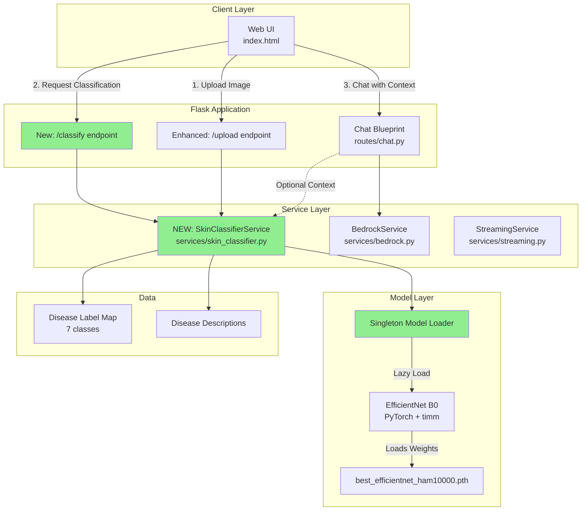
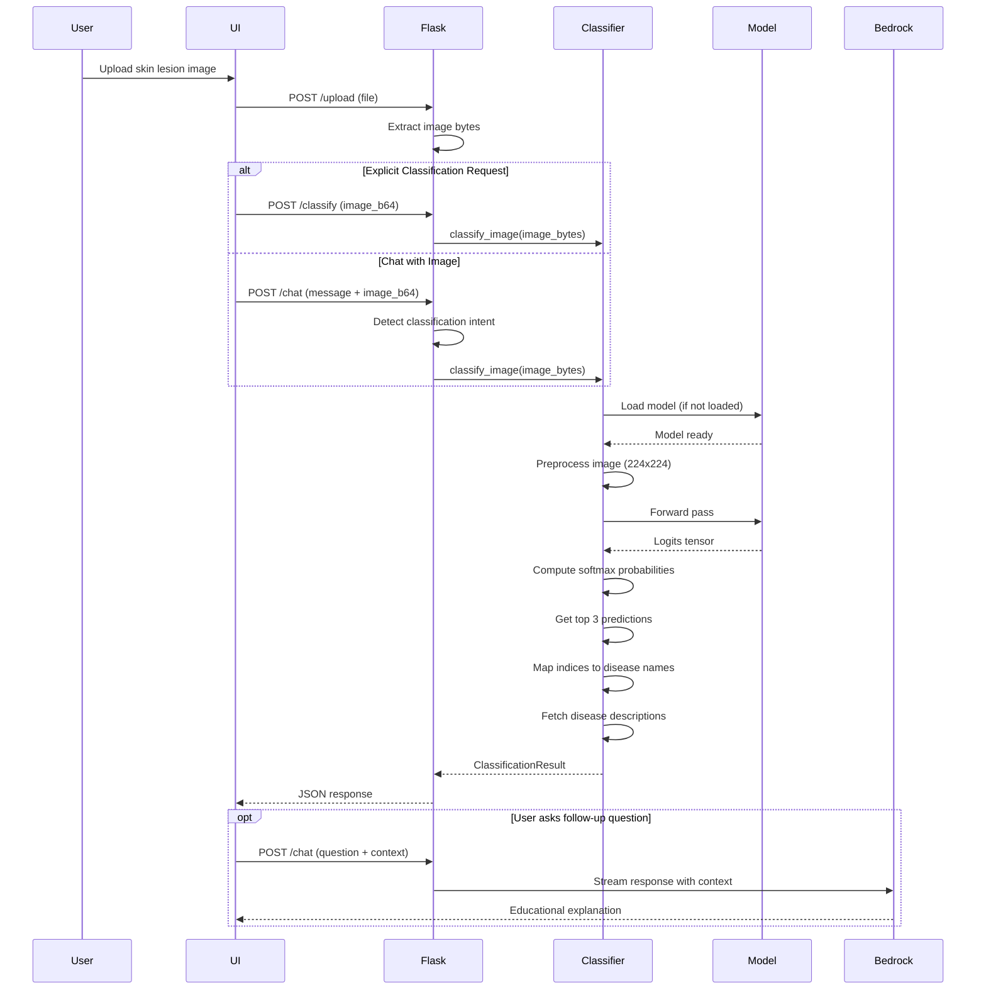

# Design Document: Skin Lesion Classifier Integration

## Overview

This design describes the integration of a pre-trained EfficientNet-based skin lesion classification model into the existing Flask chatbot application. The system enables users to upload skin lesion images and receive instant AI-powered diagnostic predictions with confidence scores and educational information. The integration preserves the existing chat functionality while adding specialized medical image analysis capabilities through a new service layer and enhanced endpoints.

## Architecture



## Main Workflow: Classification Request



## Components and Interfaces

### Component 1: SkinClassifierService

**Purpose**: Manage EfficientNet model lifecycle and provide skin lesion classification capabilities.

**Interface**:
```python
class SkinClassifierService:
    """Singleton service for skin lesion classification using EfficientNet."""
    
    def __init__(self, model_path: str, device: str = "auto"):
        """
        Initialize the classifier service.
        
        Args:
            model_path: Path to the trained model checkpoint (.pth file)
            device: Computing device ("cpu", "cuda", or "auto")
        """
        pass
    
    def is_loaded(self) -> bool:
        """Check if the model is currently loaded in memory."""
        pass
    
    def load_model(self) -> None:
        """
        Load the EfficientNet model and label map from checkpoint.
        Uses lazy loading - only loads when first needed.
        Thread-safe for concurrent requests.
        
        Raises:
            FileNotFoundError: If model checkpoint doesn't exist
            RuntimeError: If model loading fails
        """
        pass
    
    def classify_image(
        self,
        image_bytes: bytes,
        top_k: int = 3
    ) -> ClassificationResult:
        """
        Classify a skin lesion image.
        
        Args:
            image_bytes: Raw image bytes (JPEG, PNG, etc.)
            top_k: Number of top predictions to return (default: 3)
        
        Returns:
            ClassificationResult with predictions and metadata
        
        Raises:
            ValueError: If image is invalid or cannot be processed
            RuntimeError: If model inference fails
        """
        pass
    
    def get_disease_info(self, disease_code: str) -> DiseaseInfo:
        """
        Get detailed information about a disease class.
        
        Args:
            disease_code: Disease code (e.g., "mel", "bkl", "bcc")
        
        Returns:
            DiseaseInfo object with description and details
        """
        pass
    
    def unload_model(self) -> None:
        """
        Unload the model from memory to free resources.
        Useful for memory management in resource-constrained environments.
        """
        pass
```

**Responsibilities**:
- Lazy load EfficientNet model on first classification request
- Maintain singleton instance to avoid duplicate model loading
- Preprocess images to 224x224 with correct normalization
- Run inference and compute softmax probabilities
- Map model outputs to human-readable disease names
- Provide disease descriptions and educational content
- Handle errors gracefully (invalid images, model failures)
- Thread-safe for concurrent requests

### Component 2: Enhanced Chat Routes

**Purpose**: Extend existing chat blueprint with classification endpoints.

**New Endpoints**:

#### POST /classify
Dedicated endpoint for skin lesion classification.

**Request**:
```python
{
    "image_b64": str,  # Base64-encoded image
    "image_mime": str,  # MIME type (image/jpeg, image/png)
    "top_k": int,      # Optional, default: 3
}
```

**Response**:
```python
{
    "status": "success",
    "predictions": [
        {
            "disease_code": "mel",
            "disease_name": "Melanoma",
            "confidence": 0.78,
            "description": "Melanoma is the most serious type of skin cancer..."
        },
        {
            "disease_code": "bcc",
            "disease_name": "Basal Cell Carcinoma",
            "confidence": 0.12,
            "description": "Basal cell carcinoma is the most common type..."
        },
        {
            "disease_code": "nv",
            "disease_name": "Melanocytic Nevus",
            "confidence": 0.05,
            "description": "A melanocytic nevus is a benign mole..."
        }
    ],
    "processing_time_ms": 245,
    "model_info": {
        "name": "efficientnet_b0",
        "input_size": 224,
        "num_classes": 7
    },
    "disclaimer": "This is an AI prediction for educational purposes only. Consult a dermatologist for medical diagnosis."
}
```

#### Enhanced POST /chat
Add classification context when user sends images with diagnostic intent.

**Detection Logic**:
Trigger classification when:
- User message contains keywords: "diagnose", "classify", "what is this", "skin lesion", "mole", "melanoma", "cancer"
- Image is provided (`image_b64` is not empty)
- Classification hasn't been run in the last 2 messages (avoid redundancy)

**Enhanced Response**:
If classification is triggered, inject classification results into the chat context:
```python
context_injection = f"""
[SKIN LESION CLASSIFICATION RESULT]
Top prediction: {top_prediction.disease_name} ({top_prediction.confidence:.1%} confidence)
Alternative possibilities: {alternative_predictions}

The user has uploaded a skin lesion image. Use these classification results to provide educational information. 
Remind the user this is for educational purposes and they should consult a dermatologist.
"""
```

## Data Models

### Model 1: ClassificationResult

```python
@dataclass
class ClassificationResult:
    """Result of a skin lesion classification."""
    
    predictions: List[Prediction]  # Top K predictions, sorted by confidence
    processing_time_ms: float      # Inference time in milliseconds
    model_info: ModelInfo           # Model metadata
    timestamp: str                  # ISO 8601 timestamp
    disclaimer: str                 # Medical disclaimer text
    
    def to_dict(self) -> dict:
        """Convert to JSON-serializable dictionary."""
        pass
    
    def get_top_prediction(self) -> Prediction:
        """Get the highest confidence prediction."""
        pass
```

### Model 2: Prediction

```python
@dataclass
class Prediction:
    """Single disease prediction with confidence."""
    
    disease_code: str       # Short code: "mel", "bkl", "bcc", etc.
    disease_name: str       # Full name: "Melanoma", "Benign Keratosis"
    confidence: float       # 0.0 to 1.0
    description: str        # Educational description of the condition
    severity: str           # "benign", "pre-cancerous", "malignant"
    prevalence: str         # How common: "common", "uncommon", "rare"
```

### Model 3: ModelInfo

```python
@dataclass
class ModelInfo:
    """Metadata about the classification model."""
    
    name: str               # "efficientnet_b0"
    input_size: int         # 224
    num_classes: int        # 7
    framework: str          # "pytorch"
    library: str            # "timm"
    checkpoint_path: str    # Path to .pth file
```

### Model 4: DiseaseInfo

```python
@dataclass
class DiseaseInfo:
    """Detailed information about a skin lesion disease class."""
    
    code: str               # "mel", "bkl", "bcc", "akiec", "df", "nv", "vasc"
    name: str               # Full disease name
    description: str        # Multi-paragraph educational description
    severity: str           # "benign", "pre-cancerous", "malignant"
    prevalence: str         # "common", "uncommon", "rare"
    risk_factors: List[str] # List of known risk factors
    treatment: str          # General treatment approach
    prognosis: str          # Expected outcome
    
    # HAM10000 Disease Classes:
    # - akiec: Actinic keratoses and intraepithelial carcinoma
    # - bcc: Basal cell carcinoma
    # - bkl: Benign keratosis-like lesions
    # - df: Dermatofibroma
    # - mel: Melanoma
    # - nv: Melanocytic nevi (moles)
    # - vasc: Vascular lesions
```

**Validation Rules**:
- `image_bytes`: Must be valid JPEG or PNG, minimum 50x50 pixels
- `confidence`: Must be between 0.0 and 1.0, sum of all confidences ≈ 1.0
- `top_k`: Must be between 1 and 7 (number of disease classes)
- `disease_code`: Must be one of the 7 HAM10000 classes

## Algorithmic Pseudocode

### Main Classification Algorithm

```pascal
ALGORITHM classifySkinLesion(imageBytes, topK)
INPUT: imageBytes (raw image data), topK (number of predictions)
OUTPUT: result of type ClassificationResult

BEGIN
  ASSERT imageBytes IS NOT NULL
  ASSERT topK >= 1 AND topK <= 7
  
  // Step 1: Ensure model is loaded (lazy initialization)
  IF model IS NULL THEN
    loadModelFromCheckpoint()
  END IF
  
  startTime ← getCurrentTimeMillis()
  
  // Step 2: Preprocess image
  image ← decodeImage(imageBytes)
  ASSERT image.width >= 50 AND image.height >= 50
  
  image ← resizeImage(image, 224, 224)
  image ← convertToRGB(image)
  image ← normalizeImage(image, IMAGENET_MEAN, IMAGENET_STD)
  imageTensor ← toTensor(image)
  imageTensor ← addBatchDimension(imageTensor)
  
  // Step 3: Run inference
  SET model TO evaluation mode
  DISABLE gradient computation
  
  logits ← model.forward(imageTensor)
  probabilities ← softmax(logits, dim=1)
  
  // Step 4: Extract top-K predictions
  topKProbs, topKIndices ← getTopK(probabilities, topK)
  
  predictions ← EMPTY LIST
  FOR i FROM 0 TO topK - 1 DO
    diseaseIndex ← topKIndices[i]
    confidence ← topKProbs[i]
    
    diseaseCode ← labelMap[diseaseIndex]
    diseaseInfo ← getDiseaseInfo(diseaseCode)
    
    prediction ← CREATE Prediction(
      disease_code = diseaseCode,
      disease_name = diseaseInfo.name,
      confidence = confidence,
      description = diseaseInfo.description,
      severity = diseaseInfo.severity,
      prevalence = diseaseInfo.prevalence
    )
    
    predictions.append(prediction)
  END FOR
  
  endTime ← getCurrentTimeMillis()
  processingTime ← endTime - startTime
  
  // Step 5: Build result
  result ← CREATE ClassificationResult(
    predictions = predictions,
    processing_time_ms = processingTime,
    model_info = getModelInfo(),
    timestamp = getCurrentISO8601(),
    disclaimer = MEDICAL_DISCLAIMER
  )
  
  ASSERT result.predictions.length = topK
  ASSERT result.predictions[0].confidence >= result.predictions[topK-1].confidence
  
  RETURN result
END
```

**Preconditions**:
- `imageBytes` contains valid image data (JPEG or PNG format)
- Image dimensions are at least 50x50 pixels
- `topK` is a positive integer not exceeding the number of classes (7)
- Model checkpoint file exists and is readable
- Sufficient memory available for model loading and inference

**Postconditions**:
- Returns ClassificationResult with exactly `topK` predictions
- Predictions are sorted in descending order by confidence
- All confidence values are between 0.0 and 1.0
- Sum of all confidence values approximately equals 1.0 (±0.01)
- Processing time is recorded and returned
- Model remains loaded in memory for future requests

**Loop Invariants**:
- For each iteration: `predictions.length = i`
- For each prediction added: `confidence >= 0.0 AND confidence <= 1.0`
- Predictions remain sorted by confidence (descending)

### Model Loading Algorithm

```pascal
ALGORITHM loadModelFromCheckpoint()
INPUT: None (uses class state)
OUTPUT: None (modifies class state)

BEGIN
  ACQUIRE modelLock  // Thread-safe singleton
  
  // Double-check locking pattern
  IF model IS NOT NULL THEN
    RELEASE modelLock
    RETURN
  END IF
  
  // Step 1: Validate checkpoint exists
  ASSERT FILE_EXISTS(modelPath)
  
  // Step 2: Load checkpoint
  checkpoint ← torch.load(modelPath, map_location=device)
  
  ASSERT checkpoint CONTAINS "model_state_dict"
  ASSERT checkpoint CONTAINS "label_map"
  ASSERT checkpoint CONTAINS "model_name"
  
  // Step 3: Extract metadata
  labelMap ← checkpoint["label_map"]
  modelName ← checkpoint["model_name"]
  numClasses ← labelMap.size()
  
  ASSERT numClasses = 7  // HAM10000 has 7 classes
  
  // Step 4: Create model architecture
  model ← timm.create_model(
    modelName,
    pretrained = FALSE,
    num_classes = numClasses
  )
  
  // Step 5: Load trained weights
  model.load_state_dict(checkpoint["model_state_dict"])
  model.to(device)
  model.eval()  // Set to evaluation mode
  
  // Step 6: Store label map for inference
  indexToLabel ← CREATE DICTIONARY
  FOR label, index IN labelMap DO
    indexToLabel[index] ← label
  END FOR
  
  // Step 7: Create reverse mapping for fast lookup
  labelToIndex ← labelMap
  
  LOG "Model loaded successfully: " + modelName
  LOG "Device: " + device
  LOG "Classes: " + numClasses
  
  RELEASE modelLock
END
```

**Preconditions**:
- Model checkpoint file exists at `modelPath`
- Checkpoint contains required keys: model_state_dict, label_map, model_name
- PyTorch and timm libraries are installed and available
- Device (CPU/CUDA) is available and accessible

**Postconditions**:
- Model is loaded into memory and set to evaluation mode
- Label mappings (index→label and label→index) are created
- Model is moved to the specified device (CPU or CUDA)
- Thread lock is released
- Subsequent classification requests can use the loaded model

**Loop Invariants**:
- All processed label mappings maintain bijection (one-to-one correspondence)

### Image Preprocessing Algorithm

```pascal
ALGORITHM preprocessImage(imageBytes)
INPUT: imageBytes (raw image data)
OUTPUT: tensor (preprocessed 4D tensor ready for model)

BEGIN
  // Step 1: Decode image from bytes
  image ← PIL.Image.open(BytesIO(imageBytes))
  
  IF image.mode != "RGB" THEN
    image ← image.convert("RGB")
  END IF
  
  ASSERT image.width > 0 AND image.height > 0
  
  // Step 2: Resize to model input size
  image ← image.resize((224, 224), resample=BILINEAR)
  
  // Step 3: Convert to tensor
  tensor ← transforms.ToTensor()(image)
  ASSERT tensor.shape = (3, 224, 224)
  
  // Step 4: Normalize using ImageNet statistics
  MEAN ← [0.485, 0.456, 0.406]
  STD ← [0.229, 0.224, 0.225]
  
  FOR channel FROM 0 TO 2 DO
    tensor[channel] ← (tensor[channel] - MEAN[channel]) / STD[channel]
  END FOR
  
  // Step 5: Add batch dimension
  tensor ← tensor.unsqueeze(0)
  ASSERT tensor.shape = (1, 3, 224, 224)
  
  RETURN tensor
END
```

**Preconditions**:
- `imageBytes` contains valid image data
- PIL library can decode the image format
- Image has at least 1 pixel in each dimension

**Postconditions**:
- Returns 4D tensor with shape (1, 3, 224, 224)
- Tensor values are normalized using ImageNet mean and std
- Image is in RGB color space
- Tensor is ready for model inference

## Example Usage

### Example 1: Direct Classification via /classify Endpoint

```python
import base64
import requests

# Read image file
with open("skin_lesion.jpg", "rb") as f:
    image_bytes = f.read()

# Encode to base64
image_b64 = base64.b64encode(image_bytes).decode("utf-8")

# Send classification request
response = requests.post("http://localhost:5000/classify", json={
    "image_b64": image_b64,
    "image_mime": "image/jpeg",
    "top_k": 3
})

result = response.json()

# Print results
print(f"Top prediction: {result['predictions'][0]['disease_name']}")
print(f"Confidence: {result['predictions'][0]['confidence']:.1%}")
print(f"Description: {result['predictions'][0]['description']}")
print(f"\nProcessing time: {result['processing_time_ms']}ms")
```

### Example 2: Classification via Chat with Context

```python
import requests

# User uploads image and asks question
response = requests.post("http://localhost:5000/chat", json={
    "message": "What is this skin lesion? Should I be worried?",
    "image_b64": image_b64,
    "image_mime": "image/jpeg"
})

# Backend automatically:
# 1. Detects classification intent from keywords
# 2. Runs classification on the image
# 3. Injects results into chat context
# 4. Bedrock provides educational explanation

# Stream response
for line in response.iter_lines():
    if line:
        print(line.decode("utf-8"))
```

### Example 3: Programmatic Usage in Python

```python
from services.skin_classifier import SkinClassifierService

# Initialize service (singleton)
classifier = SkinClassifierService(
    model_path="datasets/best_efficientnet_ham10000.pth",
    device="auto"  # Auto-detect GPU/CPU
)

# Classify image
with open("lesion.jpg", "rb") as f:
    image_bytes = f.read()

result = classifier.classify_image(image_bytes, top_k=3)

# Access predictions
for pred in result.predictions:
    print(f"{pred.disease_name}: {pred.confidence:.1%}")
    print(f"  Severity: {pred.severity}")
    print(f"  {pred.description[:100]}...")
    print()

# Get detailed disease info
disease_info = classifier.get_disease_info("mel")
print(f"Risk factors for {disease_info.name}:")
for factor in disease_info.risk_factors:
    print(f"  - {factor}")
```

## Correctness Properties

*A property is a characteristic or behavior that should hold true across all valid executions of a system—essentially, a formal statement about what the system should do. Properties serve as the bridge between human-readable specifications and machine-verifiable correctness guarantees.*

### Property 1: Classification Determinism

For any valid image bytes and fixed model state, classifying the same image multiple times produces identical predictions with identical confidence scores within floating-point precision tolerance.

**Validates: Requirements 2.4, 8.4**

### Property 2: Probability Distribution Validity

For any classification result, all confidence scores are valid probabilities between 0.0 and 1.0 inclusive, and the sum of all confidence scores approximates 1.0 within 0.01 tolerance (valid probability distribution).

**Validates: Requirements 2.3, 8.1, 8.2**

### Property 3: Prediction Ordering

For any classification result with multiple predictions, the predictions are sorted in descending order by confidence such that predictions[i].confidence ≥ predictions[i+1].confidence for all valid indices.

**Validates: Requirements 2.1, 5.6, 8.3**

### Property 4: Model Singleton Integrity

For any number of service instantiation attempts or concurrent requests, the Classifier_Service maintains exactly one model instance in memory, and all service instances reference the same model object.

**Validates: Requirements 1.1, 9.1, 9.5**

### Property 5: Label Map Bidirectional Consistency

For any prediction, the disease code belongs to the set of 7 valid HAM10000 codes {akiec, bcc, bkl, df, mel, nv, vasc}, and the disease name exactly matches the label map entry for that disease code, with the mapping being bijective.

**Validates: Requirements 4.1, 4.7, 8.6, 8.7**

### Property 6: Image Preprocessing Correctness

For any valid image bytes, the preprocessing pipeline produces a tensor with shape (1, 3, 224, 224), dtype float32, converted to RGB color space, resized to 224x224 pixels, and normalized using ImageNet statistics.

**Validates: Requirements 3.1, 3.2, 3.3, 3.4, 3.5, 3.6**

### Property 7: Error Handling Completeness

For any invalid input or error condition, the system catches the error, returns an appropriate HTTP error code (400, 413, 500, 503), includes a non-empty descriptive error message, and does not expose sensitive internal details such as file paths or stack traces.

**Validates: Requirements 7.1, 7.2, 7.6, 7.7**

### Property 8: Top-K Parameter Enforcement

For any classification request with a specified top_k parameter between 1 and 7 inclusive, the system returns exactly top_k predictions. When top_k is omitted, the system returns exactly 3 predictions (default behavior).

**Validates: Requirements 2.2, 5.4, 5.5, 8.5**

### Property 9: Thread-Safe Concurrent Model Loading

For any concurrent pattern of multiple simultaneous model loading requests, thread-safe locking ensures exactly one loading operation occurs, all requests eventually succeed, and the loaded model is shared correctly across all threads.

**Validates: Requirements 1.3, 9.5**

### Property 10: Medical Disclaimer Presence

For any classification result returned via API or displayed in UI, the result includes the complete Medical_Disclaimer text that is non-empty, states the tool is for educational purposes only, advises consulting a dermatologist, and states the tool is not FDA-approved.

**Validates: Requirements 10.1, 10.2, 10.3, 10.4, 10.5, 10.7**

### Property 11: Classification Result Completeness

For any successful classification, the Classification_Result includes all required fields: predictions array, processing_time_ms > 0, model_info with all metadata fields, valid ISO 8601 timestamp, and medical disclaimer.

**Validates: Requirements 2.5, 2.6, 2.7, 2.8, 5.3**

### Property 12: Rate Limiting Accuracy

For any sequence of classification requests from a single IP address, the rate limiting mechanism accurately counts requests, enforces the configured limit (default 10 per minute), returns HTTP 429 with Retry-After header when exceeded, and operates correctly under concurrent load without race conditions.

**Validates: Requirements 12.1, 12.2, 12.3, 12.7**

## Error Handling

### Error Scenario 1: Invalid Image Data

**Condition**: Image bytes are corrupted, wrong format, or cannot be decoded.

**Response**: 
- Catch `PIL.UnidentifiedImageError` and `ValueError`
- Return HTTP 400 with error message: "Invalid image format. Please upload a valid JPEG or PNG file."
- Log the error with request details (without sensitive data)

**Recovery**: 
- User re-uploads a valid image
- System continues normal operation
- No state is corrupted

### Error Scenario 2: Model Checkpoint Not Found

**Condition**: Model file doesn't exist at expected path.

**Response**:
- Catch `FileNotFoundError` during model loading
- Return HTTP 503 with error: "Classification service unavailable. Model not found."
- Log error with checkpoint path for debugging
- Set `classifier.is_loaded() = False`

**Recovery**:
- Administrator places model checkpoint at correct path
- Service automatically loads model on next request
- Optionally provide `/admin/reload-model` endpoint for manual reload

### Error Scenario 3: Out of Memory (OOM)

**Condition**: GPU/CPU runs out of memory during model loading or inference.

**Response**:
- Catch `torch.cuda.OutOfMemoryError` or `RuntimeError` (OOM)
- Unload model if partially loaded
- Return HTTP 503: "Classification service temporarily unavailable. Please try again."
- Log OOM error with memory stats

**Recovery**:
- If GPU OOM, fallback to CPU device
- Implement model unloading after period of inactivity
- Consider reducing batch size or using model quantization

### Error Scenario 4: Concurrent Model Loading

**Condition**: Multiple requests try to load the model simultaneously.

**Response**:
- Use thread lock (mutex) around model loading code
- First request loads model, subsequent requests wait
- All requests succeed after model is loaded

**Recovery**:
- Automatic via double-check locking pattern
- No user action needed
- Subsequent requests use cached model

### Error Scenario 5: Invalid Image Dimensions

**Condition**: Image is too small (< 50x50 pixels) or dimensions cause processing errors.

**Response**:
- Validate image dimensions after decoding
- Return HTTP 400: "Image too small. Minimum dimensions: 50x50 pixels."
- Provide actual dimensions in error message

**Recovery**:
- User uploads higher resolution image
- Optionally suggest minimum recommended size (224x224)

### Error Scenario 6: Classification Intent Misdetection

**Condition**: Chat endpoint incorrectly triggers classification when user doesn't want it.

**Response**:
- Make classification opt-in by default
- Add explicit flag: `classify_image: bool` in chat request
- Only auto-detect if flag is enabled

**Recovery**:
- User can disable auto-classification in settings
- System learns from user feedback (future enhancement)

## Testing Strategy

### Unit Testing Approach

**Core Components to Test**:
1. **SkinClassifierService**
   - Model loading and unloading
   - Singleton pattern enforcement
   - Label map initialization
   - Thread-safety of model loading

2. **Image Preprocessing**
   - Dimension validation
   - Normalization correctness
   - Format conversion (RGB)
   - Tensor shape verification

3. **Classification Logic**
   - Inference execution
   - Softmax computation
   - Top-K selection
   - Prediction sorting

4. **Data Models**
   - Serialization (to_dict)
   - Validation rules
   - Field constraints

**Test Coverage Goals**: >85% code coverage, 100% coverage of error paths

**Key Test Cases**:
```python
def test_model_singleton():
    """Verify only one model instance exists."""
    classifier1 = SkinClassifierService.get_instance()
    classifier2 = SkinClassifierService.get_instance()
    assert classifier1 is classifier2

def test_classification_determinism():
    """Same image produces same predictions."""
    result1 = classifier.classify_image(image_bytes)
    result2 = classifier.classify_image(image_bytes)
    assert result1.predictions == result2.predictions

def test_probability_sum():
    """All confidences sum to approximately 1.0."""
    result = classifier.classify_image(image_bytes)
    total = sum(p.confidence for p in result.predictions)
    assert abs(total - 1.0) < 0.01

def test_invalid_image_handling():
    """Invalid image raises appropriate error."""
    with pytest.raises(ValueError, match="Invalid image"):
        classifier.classify_image(b"not an image")

def test_missing_checkpoint():
    """Missing model file raises FileNotFoundError."""
    with pytest.raises(FileNotFoundError):
        SkinClassifierService(model_path="nonexistent.pth")
```

### Property-Based Testing Approach

**Property Test Library**: pytest with hypothesis

**Properties to Test**:

1. **Probability Distribution Property**
   ```python
   @given(image_bytes=valid_images())
   def test_probability_distribution(image_bytes):
       result = classifier.classify_image(image_bytes)
       # All probabilities between 0 and 1
       assert all(0 <= p.confidence <= 1 for p in result.predictions)
       # Sum approximately 1.0
       assert abs(sum(p.confidence for p in result.predictions) - 1.0) < 0.01
   ```

2. **Prediction Ordering Property**
   ```python
   @given(image_bytes=valid_images(), k=integers(min_value=1, max_value=7))
   def test_predictions_sorted(image_bytes, k):
       result = classifier.classify_image(image_bytes, top_k=k)
       confidences = [p.confidence for p in result.predictions]
       assert confidences == sorted(confidences, reverse=True)
   ```

3. **Label Consistency Property**
   ```python
   @given(image_bytes=valid_images())
   def test_label_consistency(image_bytes):
       result = classifier.classify_image(image_bytes)
       for pred in result.predictions:
           assert pred.disease_code in VALID_DISEASE_CODES
           assert pred.disease_name == DISEASE_CODE_TO_NAME[pred.disease_code]
   ```

4. **Image Preprocessing Idempotency**
   ```python
   @given(image_bytes=valid_images())
   def test_preprocessing_shape(image_bytes):
       tensor = preprocess_image(image_bytes)
       assert tensor.shape == (1, 3, 224, 224)
       assert tensor.dtype == torch.float32
   ```

### Integration Testing Approach

**Integration Points to Test**:
1. `/classify` endpoint with real images
2. `/chat` endpoint with classification trigger
3. Model loading on first request
4. Session management with classification context
5. Error responses for invalid inputs

**Test Scenarios**:
```python
def test_classify_endpoint_integration(client):
    """Test full classification workflow via HTTP."""
    response = client.post('/classify', json={
        'image_b64': encode_image('test_lesion.jpg'),
        'image_mime': 'image/jpeg',
        'top_k': 3
    })
    assert response.status_code == 200
    data = response.json
    assert 'predictions' in data
    assert len(data['predictions']) == 3
    assert data['predictions'][0]['confidence'] > 0

def test_chat_with_classification_context(client):
    """Test chat endpoint with classification trigger."""
    response = client.post('/chat', json={
        'message': 'What is this skin lesion?',
        'image_b64': encode_image('test_lesion.jpg'),
        'image_mime': 'image/jpeg'
    })
    assert response.status_code == 200
    # Verify classification results injected into context
    # Verify Bedrock response includes educational content

def test_concurrent_classification_requests(client):
    """Test thread-safety with concurrent requests."""
    import concurrent.futures
    
    def classify():
        return client.post('/classify', json={
            'image_b64': encode_image('test_lesion.jpg'),
            'image_mime': 'image/jpeg'
        })
    
    with concurrent.futures.ThreadPoolExecutor(max_workers=10) as executor:
        futures = [executor.submit(classify) for _ in range(10)]
        results = [f.result() for f in futures]
    
    assert all(r.status_code == 200 for r in results)
```

## Performance Considerations

### Model Loading Strategy

**Challenge**: EfficientNet model (~20MB) takes 1-3 seconds to load.

**Solution**: Lazy loading with singleton pattern
- Load model on first classification request
- Keep model in memory for subsequent requests
- Single model instance shared across all requests

**Benefits**:
- No startup delay (model loads when needed)
- Memory-efficient (one model instance)
- Fast subsequent requests (~50-200ms)

### Inference Optimization

**Techniques**:
1. **Batch Processing** (Future Enhancement)
   - Queue multiple images and process in batches
   - Reduce GPU overhead for concurrent requests
   - Trade latency for throughput

2. **Model Quantization** (Future Enhancement)
   - Convert FP32 model to INT8
   - Reduce model size by 4x
   - Faster inference on CPU (~2-3x speedup)

3. **GPU Acceleration**
   - Auto-detect CUDA availability
   - Move model to GPU if available
   - Significant speedup: 200ms (CPU) → 50ms (GPU)

### Caching Strategy

**Response Caching**: Cache classification results for identical images
- Key: SHA256 hash of image bytes
- Value: ClassificationResult (JSON)
- TTL: 1 hour
- Storage: Redis or in-memory LRU cache

**Implementation**:
```python
from functools import lru_cache
import hashlib

@lru_cache(maxsize=100)
def classify_with_cache(image_hash: str, image_bytes: bytes) -> ClassificationResult:
    return classifier.classify_image(image_bytes)

def classify_cached(image_bytes: bytes) -> ClassificationResult:
    image_hash = hashlib.sha256(image_bytes).hexdigest()
    return classify_with_cache(image_hash, image_bytes)
```

**Benefits**:
- Instant response for repeated images
- Reduces GPU/CPU usage
- Improved user experience

### Memory Management

**Strategy**: Unload model after period of inactivity
- Track last inference timestamp
- Background thread checks every 5 minutes
- Unload model if idle > 30 minutes
- Automatically reload on next request

**Benefits**:
- Free memory when service not in use
- Suitable for resource-constrained environments
- No impact on active usage patterns

### Asynchronous Processing (Future Enhancement)

**Current**: Synchronous classification (blocking request)

**Future**: Async task queue with Celery
- Submit classification job to queue
- Return job ID immediately
- Poll for results or use WebSocket notification

**Benefits**:
- Non-blocking API
- Better handling of high load
- Can process multiple images concurrently

## Security Considerations

### Input Validation

**Image Upload Security**:
1. **File Type Validation**
   - Check MIME type matches actual content
   - Reject executable files disguised as images
   - Use PIL to verify valid image structure

2. **File Size Limits**
   - Maximum upload size: 10MB
   - Prevent DoS via large file uploads
   - Configure in Flask: `MAX_CONTENT_LENGTH`

3. **Malicious Image Detection**
   - Validate image dimensions before processing
   - Catch and handle corrupted image errors
   - Sanitize image metadata (EXIF data)

### Medical Disclaimer

**Critical Requirement**: All classification results MUST include medical disclaimer.

**Disclaimer Text**:
```
⚠️ IMPORTANT MEDICAL DISCLAIMER ⚠️
This AI classification is for educational purposes only and should NOT be used as 
a substitute for professional medical advice, diagnosis, or treatment. 

Always consult a qualified dermatologist or healthcare provider for any concerns 
about skin lesions. Early detection and professional evaluation are crucial for 
proper diagnosis and treatment.

This tool is not FDA-approved and should not be used to make medical decisions.
```

**Enforcement**:
- Include disclaimer in every classification response
- Display prominently in UI
- Log user acknowledgment (regulatory compliance)

### Privacy and Data Handling

**Principles**:
1. **No Image Storage**: Delete uploaded images immediately after classification
2. **No Personal Data**: Don't collect patient information with images
3. **Session Isolation**: Each user's data stays in their session
4. **Audit Logging**: Log classification events (without images) for monitoring

**HIPAA Considerations** (if applicable):
- Encrypt images in transit (HTTPS)
- Don't store images on disk
- Implement access controls
- Provide data deletion capabilities

### Rate Limiting

**Protect Against Abuse**:
- Apply rate limit to `/classify` endpoint
- Limit: 10 classifications per minute per IP
- Prevent resource exhaustion attacks
- Return HTTP 429 (Too Many Requests) when exceeded

```python
from flask_limiter import Limiter

limiter = Limiter(app, key_func=get_remote_address)

@app.route('/classify', methods=['POST'])
@limiter.limit("10 per minute")
def classify():
    # Classification logic
    pass
```

### Model Security

**Checkpoint Integrity**:
- Store model checkpoint in secure location
- Verify checkpoint hash on first load
- Prevent unauthorized model replacement
- Use read-only permissions on model file

## Dependencies

### Required Libraries

**Core ML Libraries**:
- `torch>=2.0.0` - PyTorch deep learning framework
- `timm>=0.9.0` - PyTorch Image Models (EfficientNet implementation)
- `torchvision>=0.15.0` - Image transformations

**Image Processing**:
- `Pillow>=10.0.0` - Image loading and manipulation
- `numpy>=1.24.0` - Numerical operations

**Web Framework**:
- `Flask>=2.3.0` - Already installed (existing dependency)
- `flask-session>=0.5.0` - Already installed
- `flask-limiter>=3.3.0` - Already installed

**Utilities**:
- `python-dotenv>=1.0.0` - Already installed
- `dataclasses` - Built-in (Python 3.7+)
- `typing` - Built-in

### Hardware Requirements

**Minimum**:
- CPU: 2 cores, 2.0 GHz
- RAM: 4GB (2GB for model, 2GB for system)
- Storage: 100MB for model checkpoint

**Recommended**:
- CPU: 4+ cores, 3.0 GHz
- RAM: 8GB
- GPU: NVIDIA with 2GB+ VRAM (CUDA support)
- Storage: SSD for faster model loading

### Model Checkpoint

**File**: `datasets/best_efficientnet_ham10000.pth`

**Contents**:
```python
{
    'epoch': int,                       # Training epoch number
    'model_name': 'efficientnet_b0',    # timm model identifier
    'model_state_dict': OrderedDict,    # Trained weights
    'label_map': dict,                  # {'akiec': 0, 'bcc': 1, ...}
    'val_accuracy': float               # Validation accuracy
}
```

**Size**: ~20MB

**Location**: Must be accessible from Flask application root

### Configuration

**New Config Variables** (add to `config.py`):
```python
@dataclass
class ClassifierConfig:
    """Skin lesion classifier configuration."""
    
    model_path: str = "datasets/best_efficientnet_ham10000.pth"
    device: str = "auto"  # "cpu", "cuda", or "auto"
    enable_caching: bool = True
    cache_size: int = 100
    auto_unload_minutes: int = 30
    max_image_size_mb: int = 10
    rate_limit: str = "10 per minute"
```

### External Services

**None**: This feature is fully self-contained and does not require external APIs or services.

**Existing Dependencies**:
- AWS Bedrock (for chat context enhancement) - Already configured
- Flask sessions - Already configured

### Database

**None**: No database required. Classification results are ephemeral.

**Optional**: Redis for caching (future enhancement)
- Persistent cache across application restarts
- Distributed caching for multi-instance deployments

## Implementation Notes

### Integration Checklist

1. ✅ Create `services/skin_classifier.py` with `SkinClassifierService` class
2. ✅ Add data models to `models/classification.py`
3. ✅ Create `/classify` endpoint in `routes/chat.py`
4. ✅ Add classification trigger detection to `/chat` endpoint
5. ✅ Update `config.py` with `ClassifierConfig`
6. ✅ Add disease information database to `data/diseases.json`
7. ✅ Install required dependencies: `torch`, `timm`, `torchvision`
8. ✅ Write unit tests for classifier service
9. ✅ Write integration tests for endpoints
10. ✅ Add UI components for classification display
11. ✅ Update documentation and API reference

### Backwards Compatibility

**Guaranteed**:
- Existing chat functionality remains unchanged
- `/chat` endpoint maintains same API
- `/upload` endpoint works as before
- No breaking changes to session management

**Optional**:
- Classification is opt-in (not auto-triggered by default)
- Can be disabled via configuration flag
- No impact if model checkpoint is missing (service returns 503)

### Deployment Considerations

**Production Checklist**:
1. Verify model checkpoint exists at configured path
2. Test with GPU if available (performance validation)
3. Configure rate limits appropriately
4. Enable caching for better performance
5. Monitor memory usage under load
6. Set up health check endpoint (`/health/classifier`)
7. Configure auto-restart on OOM errors
8. Add metrics: classification count, latency, errors
9. Test with real dermatology images
10. Legal review of medical disclaimer text
